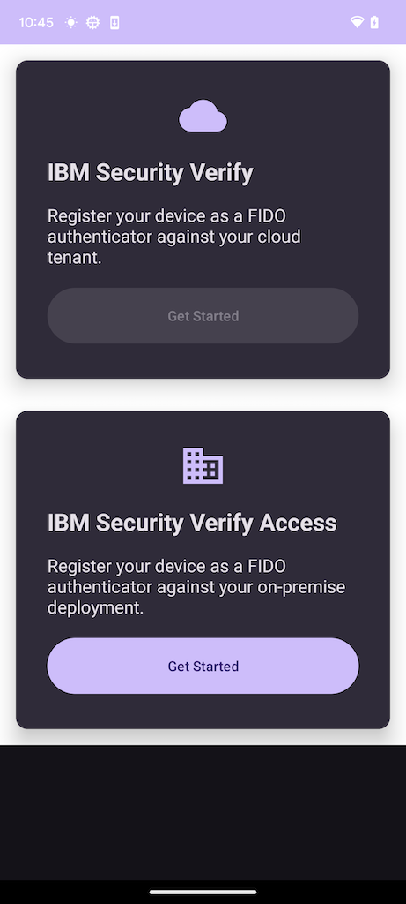
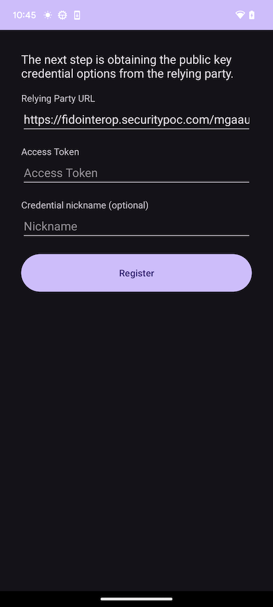
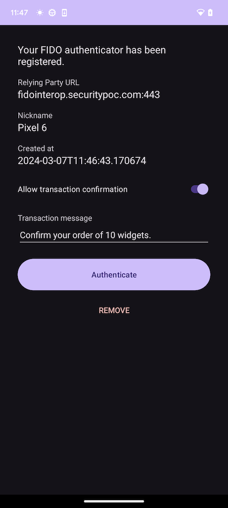
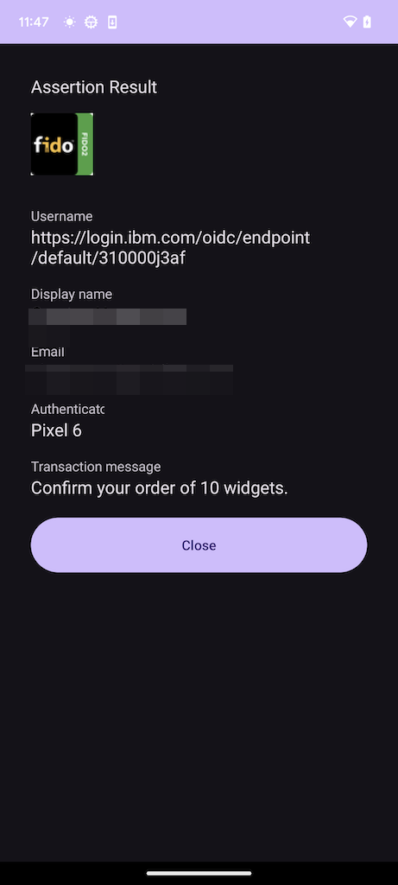

# IBM Security Verify FIDO2™ Sample App for Android

The FIDO2 sample app is an end-to-end mobile app which uses the FIDO2 server features in IBM Security Verify Access (on-premises) and IBM Security Verify (cloud).

## Getting started
This demo works with an IBM Security Verify Access instance, hosted on https://fidointerop.securitypoc.com An IBMid is required to access it.

1. Clone this repository and open it in Android Studio
1. Create a "Run/Debug configuration" for the `fido2_demo` module
1. Start the `fido2_demo` module
1. Login to https://fidointerop.securitypoc.com, go to `Account settings` and copy your `Access Token`
1. In the demo app, click on `Get Started`:  
1. Paste your access token, assign a nickname to your registration and click on `Register`:  
1. You will be presented with a biometric authentication dialog, similar to [this one](https://developer.android.com/training/sign-in/biometric-auth#display-login-prompt)
1. Complete the authentication
1. When successfully registered, the app redirects to the `Authenticate` screen:
 
1. Change the `Transaction message` as you like. Toggle it on and off will automatilly prefill a random text.
1. Click on `Authenticate`
1. You will again be presented with a biometric authentication dialog. This time, the transaction message from the previos step will be displayed in the dialog header.
1. Complete the authentication
1. When successfully verified, the app displays the result: 

## License
This package contains code licensed under the MIT License (the "License"). You may view the License in the [LICENSE](../../LICENSE) file within this package.
  
FIDO™ and FIDO2™  are  trademarks (registered in numerous countries) of FIDO Alliance, Inc. 
